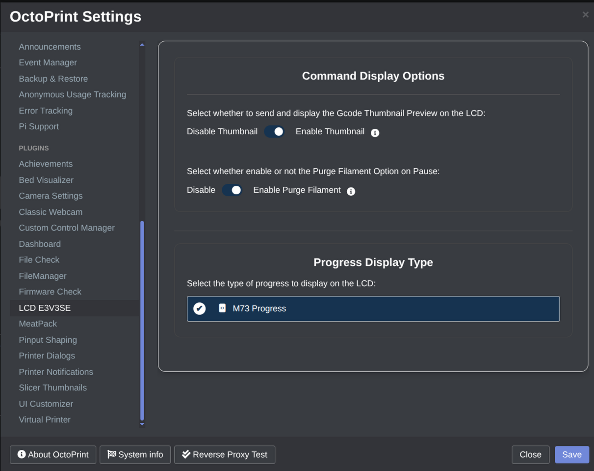
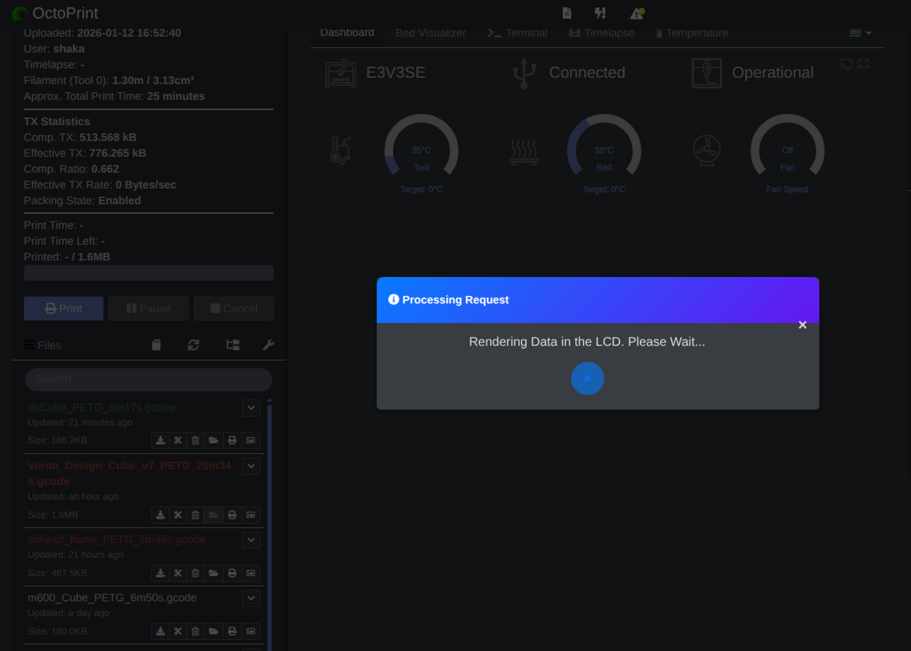

# OctoPrint-LCD_E3V3SE

Plugin to send print job details and thumbnails to the LCD of the E3V3SE (requires modified firmware).
Fully compatible with Meatpack and M600 commands

## Table of contents
- [Installation](#installation)
- [Configuration](#configuration)
- [Preview](#preview)
- [Starting Job](#starting-job)
- [Author](#author)
- [Disclaimer](#disclaimer)
- [License](#license)

## Requirements.
> [!Important]
> 
> * Enable M73 in the slicer. Follow the [Wiki Article to Enable M73 Support](https://github.com/navaismo/Octoprint-LCD_E3V3SE/wiki/Enable-M73-Support).
> * Install the Custom Firmware for the Printer, [Ensure to use the Latest BELAYA Version](https://github.com/navaismo/Marlin_bugfix_2.1_E3V3SE/releases). 
> 

## Installation.

> [!TIP]
> 
> 1. Download from the Release Page the Latest Version.
> 2. Open OctoPrint and go to `Settings` -> `Plugin Manager`.
> 3. Click `Get More...`.
> 4. Select `Install from File` and add the downloaded ZIP
> 5. Restart OctoPrint.
>

## Configuration. 
1. Open OctoPrint and go to `Settings` -> `LCD E3V3SE`.
2. Configure the plugin options:
   - `Enable G-code Preview`: send and render the 96x96 thumbnail on the LCD.
   - `Progress Type`: `M73`-based progress parsing.
   - `Enable Purge Filament`(Optional): show a purge prompt when the printer is paused.
3. Click `Save` and restart OctoPrint if prompted.

## Preview.

## Starting Job.

* While Rendering the LCD you will see the Pop-Up in the screen:

> [!Important]
> 
> When starting a Job the printer will Pause and execute the `PAUSE SCRIPT` defined in the Ocotprint Script settings. 
> So the first thing after connect Octoprint is to HOME the AXIS! Otherwise the printer will fail to move to the Pause Position.

* The printer will Pause, Render and Continue the job:

## Disclaimer
BAU:
THE SOFTWARE IS PROVIDED "AS IS", WITHOUT WARRANTY OF ANY KIND, EXPRESS OR IMPLIED, INCLUDING BUT NOT LIMITED TO THE WARRANTIES OF MERCHANTABILITY, FITNESS FOR A PARTICULAR PURPOSE AND NONINFRINGEMENT. IN NO EVENT SHALL THE AUTHORS OR COPYRIGHT HOLDERS BE LIABLE FOR ANY CLAIM, DAMAGES OR OTHER LIABILITY, WHETHER IN AN ACTION OF CONTRACT, TORT OR OTHERWISE, ARISING FROM, OUT OF OR IN CONNECTION WITH THE SOFTWARE OR THE USE OR OTHER DEALINGS IN THE SOFTWARE.

TL;DR:
If your house burns down because this app malfunctioned, you cannot sue me.

## License
This project is licensed under the AGPL license.

## Author
Created by navaismo
