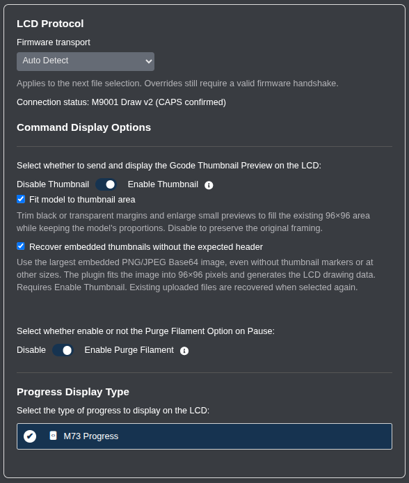
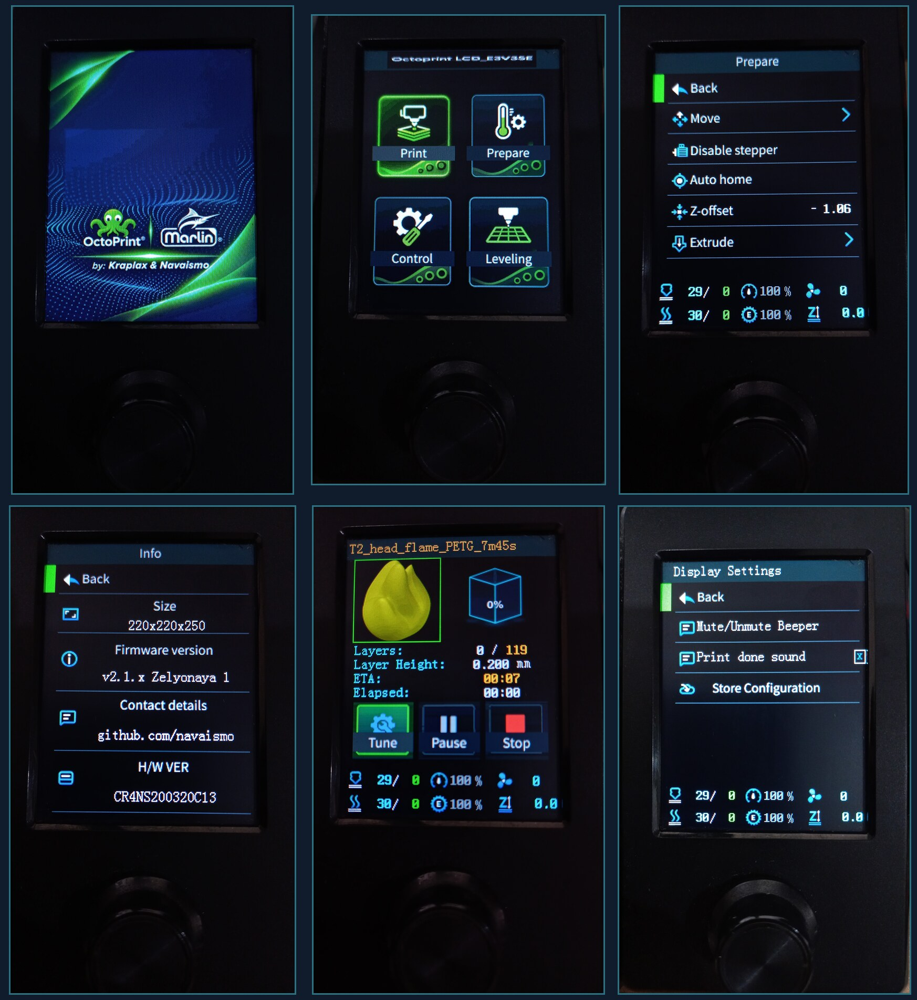

# OctoPrint-LCD_E3V3SE

Send print details and a 96×96 thumbnail to the Ender-3 V3 SE LCD through the
printer's normal OctoPrint connection. MeatPack and native M600 prompts remain.

**main** is the maintained unified implementation for OctoPrint **1.11.x and
2.0.x**, with automatic selection of the existing Marlin thumbnail protocols:

| Firmware | Protocol |
|---|---|
| `c13_octoprint` | M9001 v1 (START/C/END) |
| `c14_octoprint` | M9001 v1 (START/C/END) |
| `c13_pure_octoprint` | M9001 Draw v2 (CAPS/B/D/E/A) |
| `c14_pure_octoprint` | M9001 Draw v2 (CAPS/B/D/E/A) |

The existing v2 DrawingClient and counted job holds remain the foundation. An
independent legacy transport sends RGB565 rows with firmware acknowledgments.
Both use OctoPrint's public command API and normal serial/MeatPack connection.
Recent hardware reports include communication timeouts and checksum resends;
passing software tests does not establish their cause or physical stability.
See the [compatibility audit and four-way validation guide](docs/unified-protocols.md).

## Table of contents

- [Requirements](#requirements)
- [Installation](#installation)
- [Configuration](#configuration)
- [LCD screens](#lcd-screens)
- [Protocol and architecture](#protocol-and-architecture)
- [Communication sequence](#communication-sequence)
- [Memory and serial cost](#memory-and-serial-cost)
- [Validation](#validation)
- [Purging a paused print](#purging-a-paused-print)
- [Disclaimer](#disclaimer)
- [License](#license)
- [Author](#author)

## Requirements

- Modified Marlin from the matrix, with OCTOPRINT_PLUGIN and
  DWIN_RENDER_THUMBNAIL; Pure Host v2 also requires M9001_DRAW_PROTOCOL.
  Firmware and TFT resources must match the printer. The plugin does not flash
  firmware or change the existing native LCD layout.
- The matching plugin `main`, OctoPrint and Pillow (declared dependency).
- Slicer M73 progress. M73 L supplies actual layer progress; M73 P/R supplies
  percentage/time-left. [Slicer setup](https://github.com/navaismo/Octoprint-LCD_E3V3SE/wiki/Enable-M73-Support).
- Compatible TJC LCD resources for the new splash, buttons and cube artwork.
  They are installed separately; the plugin does not update TFT firmware.

## Installation

1. Obtain the `main` plugin ZIP and matching firmware from the matrix.
2. In OctoPrint, open **Settings → Plugin Manager → Get More → Install from File**.
3. Install the ZIP and restart OctoPrint.
4. Update Marlin using the printer's existing firmware-update procedure.

The same plugin supports both transports. An old START/C/END-only plugin cannot
communicate with Pure Host v2; its record format and flow control are different.

## Configuration

1. Open **Settings → LCD E3V3SE**.
2. Enable **G-code Preview** to draw the thumbnail; without it, v2 uses MODEL
   and v1 keeps its native screen.
3. Leave **LCD Protocol → Auto Detect**, or select Legacy M9001 v1 / M9001 Draw v2.
   The connection status appears in settings and the plugin log. Overrides still
   require firmware confirmation and apply on the next file selection.
4. Select **M73** progress and optionally enable the paused-filament purge button.
5. Save the settings and restart OctoPrint if prompted.

Detection sends one non-destructive `M9001 Q` per connection. A valid v2 CAPS
response selects v2. After two seconds without CAPS, legacy becomes a candidate;
its START must be acknowledged before any pixels are sent. START is never used
as a connection-time probe. A v2 override fails without valid CAPS. Unsupported
CAPS, timeouts, errors, cancellation and disconnect end preparation and release
only the plugin's job hold, allowing the normal job lifecycle to continue.

PNG and JPEG `thumbnail`, `thumbnail_PNG`, `thumbnail_JPG` and `thumbnail_JPEG`
blocks at 96×96 are supported without a slicer identification header. Optionally
enable **Recover embedded thumbnails without the expected header** to use PNG/JPEG
Base64 comments without those markers or at other sizes. Recovery selects the
largest valid embedded image to retain model detail before fitting it into the
LCD's 96×96 area. The host generates the RGB565 drawing commands. A checksum/hash alone
cannot reconstruct an image; the G-code must contain the encoded image data.
The option defaults to off and requires G-code Preview. Files already uploaded
are recovered and cached when selected again, without another upload.

**Fit model to thumbnail area** is enabled by default. It trims transparent or
near-black margins and scales the visible model up or down to fit 96×96 while
preserving its aspect ratio. This makes a padded or tiny source preview readable
without changing Marlin's drawing bounds. Disable it to preserve the slicer's
original framing. Enlarging a small source cannot restore missing image detail;
recovery uses a larger source when one is embedded in the G-code. Older recovery
caches are refreshed once when the file is selected again.

## LCD screens

On Pure Host v2, MAIN Print displays **Upload to Host / and start from there**, with working Back.
The print card keeps the filename on top, a green-framed thumbnail on the left,
the native cube on the right, four metadata rows below, and native controls and
temperatures at the bottom.

> [!IMPORTANT]
> LCD Only renders the print Job if it is in Main Menu or Print Menu, the rendering from any other Menu is cancelled by design.

| Field | Source and behavior | Value color |
|---|---|---|
| Layers, current | M73 L; changes during printing | White |
| Layers, total | M9000 L; fixed job metadata | Yellow |
| Layer Height | Nominal thickness from G-code settings | White |
| ETA | Initial total estimated duration, HH:MM; fixed with M9000 E | Yellow |
| Elapsed | Marlin print timer, HH:MM; advances during printing | White |

Labels are cyan. Full `65535 / 65535` counters fit. ETA does not follow later
M73 R time-left updates. Unknown metadata use placeholders. Old cached JSON
without layer height is repaired from the stored G-code, including settings
after EXECUTABLE_BLOCK_END; no re-upload is needed.

Tune opens the native menu below the thumbnail. Returning restores labels and
values without transferring the image again. Pause/Continue, Stop and their
confirmation dialogs remain native. Confirmed Stop also leaves a preview when
no print has started. The finish screen retains the summary and confirmation.

The extra **Progress text label is currently disabled** in Marlin to isolate LCD
traffic after reported timeouts/resends. The percentage cube remains enabled.
This change is not proof of the checksum error's cause.

## Protocol and architecture

The following drawing details describe v2. Legacy uses the same image processing
and hold owner, while retaining its native per-pixel renderer at (12,25). It
sends twelve RGB565 pixels per C command, waits for each `M9001 ACK LINE n`, then
requires END followed by thumbnail-rendered. At most one row is queued. Legacy
receives T/L/P metadata; H/E/D1 remain v2-only. R1/R0 pause notifications are
supported by all four audited firmware branches. See the
[full M9000 mapping and failure behavior](docs/unified-protocols.md).

The host does the expensive work: image decoding, alpha/background composition,
96×96 resize, RGB565 conversion, horizontal runs, vertical merging and color
buckets. Black pixels are skipped after clearing. A bounded STRIP fallback
handles images with many unique colors. No image-sized MCU buffer is allocated.

M9001 v2 uses the ordinary OctoPrint command queue and existing MeatPack path.
There is no second serial connection or raw-byte mode. Records use CRC32,
nonzero session IDs, sequence numbers and G-free Base64 (uppercase G becomes _).
The largest command is 79 characters, or 95 with the maximum line/checksum wrapper,
within MAX_CMD_SIZE=96 including NUL.

| Command | Purpose |
|---|---|
| M9000 A1 | Announce plugin connection |
| M9000 N / L / H / E | Filename, total layers, layer height in µm, fixed total minutes |
| M9000 S1 / D1 / F1 | Open print card, restore values after drawing, show completion |
| M9001 Q | Negotiate v2 once per connection |
| M9001 B | Begin a session |
| M9001 D | Submit up to 42 bytes of COLOR/RECT/STRIP operations |
| M9001 E | End with stream CRC and wait for an LCD fence |
| M9001 A | Abort the session |

M9000 E is duration metadata; M9001 E ends a drawing transfer. B/D/E/A are followed
immediately by their encoded record. Packet fields and error responses are in
[the protocol guide](docs/host-only-rendering.md).

Marlin checks every operation's bounds before drawing. One batch is outstanding
at a time; one matching application ACK grants the next batch. There is no ACK
for each pixel/primitive. Immediately repeated DATA is acknowledged without
redrawing. Ordinary G-code `ok` does not mean that the LCD finished: END waits
for a fresh LCD reply and then matching DONE.

The executor yields between frames, checks UART space and retains the existing
ten-frame/16 ms pacing at 115200 baud. Encoder actions, native prompts and
non-status commands preempt a transfer. No heartbeat or full-screen repaint runs
during printing. Native fields are checked one per 1.25 seconds, roughly five
seconds per field, and only changed values are drawn.

M9001 CRC protects drawing records. It does not correct normal G-code checksum
mismatches or establish that USB/UART traffic cannot be lost.

## Purging a paused print

The optional purge button asks the backend to extrude 15 mm at 150 mm/min.
It preserves the E coordinate, extrusion mode and feedrate and keeps the motors
enabled. Units must be confirmed as millimeters; unknown extrusion state is
rejected rather than assuming M82 or M83. The plugin observes sent G-code and
reads M503/M114 during an ordinary pause. These read-only commands do not move
or reconfigure the printer. Reconnects clear the saved state.

During a firmware filament change, the button uses M876 S0 only when Marlin
offers Purge more. Marlin then controls the purge length and preserves its own
resume position. Earlier insertion/heating prompts must be answered normally.
Purge requires printer-control permission and an enabled purge option; it is
unavailable during printing or the initial rendering job hold. Resume still belongs
to OctoPrint and the configured pause/resume scripts.

Run the offline regression checks with `python -m unittest discover -s tests`
and `node tests/test_purge_frontend.js`. Printer validation is still needed for
absolute/relative extrusion, repeated purges and M600 prompt handling.

## Communication sequence

```mermaid
sequenceDiagram
    actor User
    participant OP as OctoPrint queue
    participant Plugin as LCD plugin
    participant FW as Marlin M9000/M9001
    participant LCD as TJC display
    Plugin->>OP: On connection: M9000 A1, M9001 Q
    OP->>FW: Send through normal serial/MeatPack path
    FW-->>OP: CAPS v2, payload 42
    OP-->>Plugin: Received hook
    User->>OP: Select or start a local job
    OP->>Plugin: FileSelected / beforePrintStarted
    Plugin->>OP: Acquire one counted file-stream hold
    Note over OP,Plugin: File streaming held; plugin commands still pass
    Plugin->>Plugin: Load metadata, optimize thumbnail
    Plugin->>OP: M9000 metadata, S1; M9001 B
    OP->>FW: Open native card and begin session
    FW-->>OP: Session ACK
    OP-->>Plugin: Received hook
    loop One bounded batch at a time
        Plugin->>OP: M9001 D, CRC and sequence
        OP->>FW: Numbered command
        FW->>LCD: Incremental COLOR/RECT/STRIP frames
        FW-->>OP: Batch ACK after execution
        OP-->>Plugin: Grant next batch
    end
    Plugin->>OP: M9001 E, final CRC
    OP->>FW: End drawing
    FW->>LCD: Fresh completion fence
    LCD-->>FW: Current fence reply
    FW-->>OP: DONE after settle
    OP-->>Plugin: Matching session DONE
    Plugin->>OP: M9000 D1; release owned hold
    OP->>FW: Normal print G-code and M73 updates
    FW->>LCD: Native changed fields and progress
```

A single worker owns preparation and rendering. Failure, cancellation or
disconnect releases only its own job hold. It never auto-resumes a real pause,
answers an M600 prompt or releases another plugin's hold. A drawing failure
leaves native controls available instead of blocking the job indefinitely.

## Memory and serial cost

Moving image analysis to OctoPrint removes SD thumbnail buffers and decoders
from this host-only firmware. Marlin's executor uses 76 bytes of persistent
state, including its 42-byte payload, with no full framebuffer.

| Marlin build | RAM bytes | Flash bytes |
|---|---:|---:|
| Original host firmware | 28260 | 245964 |
| Last measured cleanup | 22620 | 211528 |

Savings: **5,640 bytes RAM and 34,436 bytes Flash**. This measurement predates
commenting out the Progress label call; that source change has not been rebuilt.
Static RAM does not measure peak stack/heap.

For the same reference thumbnail, the old/new sender used **770 → 127 commands**,
**54,362 → 10,441 numbered bytes**, **36,609 → 13,236 MeatPack bytes** and
**3,814 → 995 TJC frames**, preserving every RGB565 pixel. A noisy image can cost
more: the unique-color fixture used **42,730 → 58,583 MeatPack bytes**. These are
fixture counts, not physical render-time or print-stability measurements.

Electrical power consumption has not been measured. Memory and serial-work
savings should not be presented as lower printer wattage. See the paired
firmware's [audit](https://github.com/navaismo/Marlin_bugfix_2.1_E3V3SE/tree/c13_octoprint_cleanup/docs/c13-cleanup.md)
for stage measurements, test evidence and remaining hardware checks.

## Validation

Run `python -m unittest discover -s tests` and
`node tests/test_purge_frontend.js` plus `node tests/test_protocol_frontend.js`.
Run the Python suite separately under OctoPrint 1.11.x and 2.0.x.
Full lifecycle tests need OctoPrint; image
tests need Pillow. The firmware repository supplies ASan/UBSan, exact-pixel,
sequence, abort, bounds and MeatPack round-trip checks. Earlier native checks
included the enabled caption; update that expectation before using them to
validate the currently commented-out draw call.

Retest sustained host printing, timeouts/resends, controls, M600, disconnects and
LCD pacing on hardware. Passing offline tests does not resolve the reported
communication issue. No plugin installation or hardware flashing is performed
by the tests.

The [validation guide](docs/unified-protocols.md) records the software test
results, remaining legacy limitations and exact manual checks for 1.x/v1,
1.x/v2, 2.0/v1 and 2.0/v2. Hardware compatibility requires those physical checks.

## Disclaimer
BAU:
THE SOFTWARE IS PROVIDED "AS IS", WITHOUT WARRANTY OF ANY KIND, EXPRESS OR IMPLIED, INCLUDING BUT NOT LIMITED TO THE WARRANTIES OF MERCHANTABILITY, FITNESS FOR A PARTICULAR PURPOSE AND NONINFRINGEMENT. IN NO EVENT SHALL THE AUTHORS OR COPYRIGHT HOLDERS BE LIABLE FOR ANY CLAIM, DAMAGES OR OTHER LIABILITY, WHETHER IN AN ACTION OF CONTRACT, TORT OR OTHERWISE, ARISING FROM, OUT OF OR IN CONNECTION WITH THE SOFTWARE OR THE USE OR OTHER DEALINGS IN THE SOFTWARE.

TL;DR:
If your house burns down because this app malfunctioned, you cannot sue me.

## License
This project is licensed under the AGPL license.

## Author
Created by navaismo
